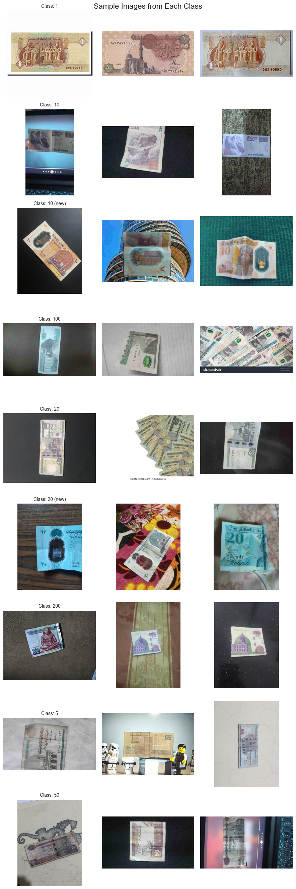
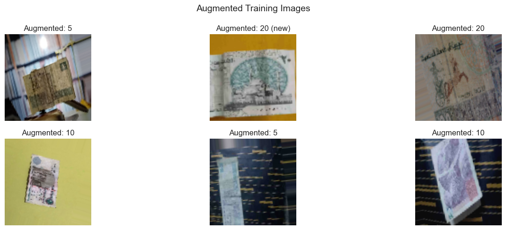
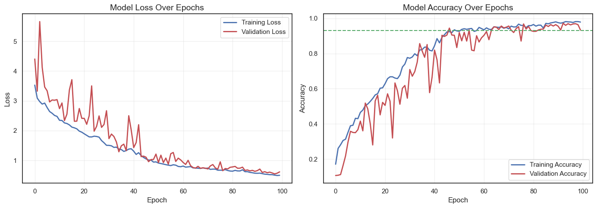
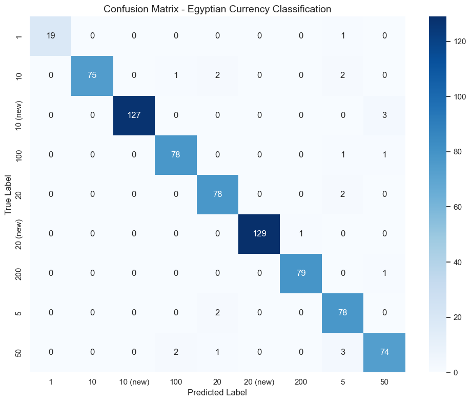
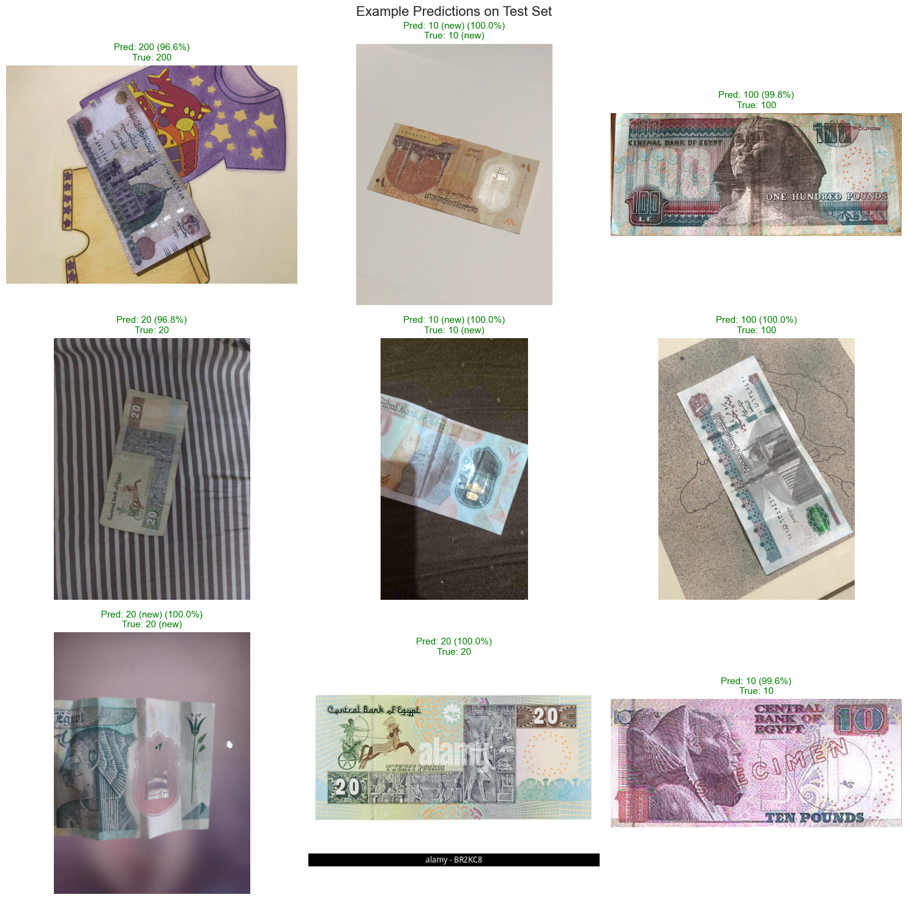

# Egyptian Currency Classification using CNN

<div align="center">

### 🎓 Multimedia Deep Learning Course Project
**Supervised by: Dr. Eman Gouda**

---

### 👥 Team Members

| Name | ID |
|------|-----|
| Karim Wael Balbaa | 241482823 |
| Moustafa Ahmed Moustafa Abdelmoneim | 241477284 |
| Mathew Moussa Halim | 241477219 |
| Ali Khaled Ali Kotb Shaaban | 241477554 |
| Ahmed Ibrahim Amin El Refai | 241496423 |
| Ezzeldin Ashraf Mohamed | 241407315 |

---

</div>

## 📖 Project Overview

A deep learning project that classifies Egyptian banknotes (2023 new currency) using a **custom Convolutional Neural Network (CNN) built from scratch** with Keras/TensorFlow. 

**Key Achievement**: 🎯 **96.55% Test Accuracy** (Exceeds 93% target requirement)

**Important**: ⚠️ **No transfer learning or pre-trained models were used** (as per project requirements). The entire CNN architecture was designed and trained from scratch.

### 🔗 Dataset Source
[Egyptian New Currency 2023 - Kaggle](https://www.kaggle.com/datasets/belalsafy/egyptian-new-currency-2023)

---

## 📋 Table of Contents
- [Problem Statement](#problem-statement)
- [Dataset](#dataset)
- [CNN Architecture](#cnn-architecture)
- [Training Configuration](#training-configuration)
- [Results](#results)
  - [Training Curves](#training-curves)
  - [Test Results & Metrics](#test-results--metrics)
  - [Confusion Matrix](#confusion-matrix)
  - [Example Predictions](#example-predictions)
- [Quick Start](#quick-start)
- [Usage](#usage)
- [Repository Structure](#repository-structure)

---

## Problem Statement

**Objective**: Build a CNN model from scratch to classify Egyptian banknotes into their respective denominations.

**Challenge**: 
- Classify 9 different Egyptian currency denominations: **1, 5, 10, 20, 50, 100, 200 EGP**
- Handle newly issued notes: **"10 (new)"** and **"20 (new)"** alongside older versions
- Deal with class imbalance (Class "1" has only 60 training samples vs. 346 for "20 (new)")
- Work with limited data (~2,600 training images) requiring strong regularization and augmentation
- Achieve real-world robustness across varying lighting, angles, and image quality

**Why This Matters**: Automated currency classification is useful for:
- Banking automation and ATM systems
- Retail point-of-sale verification
- Mobile payment apps with visual verification
- Accessibility tools for visually impaired users

---


## 📊 Dataset

### Overview

<div align="center">

| Metric | Value |
|--------|-------|
| **Total Images** | 3,687 |
| **Training Set** | 2,637 (71.5%) |
| **Validation Set** | 760 (20.6%) |
| **Test Set** | 290 (7.9%) |
| **Classes** | 9 denominations |
| **Image Format** | RGB, resized to 96×96 pixels |
| **Source** | [Kaggle Dataset](https://www.kaggle.com/datasets/belalsafy/egyptian-new-currency-2023) |

</div>

### 💵 Class Distribution (Training Set)

<div align="center">

| Class | Count | Percentage | Class Weight | Status |
|-------|-------|------------|--------------|---------|
| 1 EGP | 60 | 2.3% | 4.88 | ⚠️ Underrepresented |
| 5 EGP | 334 | 12.7% | 0.88 | ✅ Balanced |
| 10 EGP (old) | 315 | 11.9% | 0.93 | ✅ Balanced |
| 10 EGP (new) | 317 | 12.0% | 0.92 | ✅ Balanced |
| 20 EGP (old) | 322 | 12.2% | 0.91 | ✅ Balanced |
| 20 EGP (new) | 346 | 13.1% | 0.85 | ✅ Balanced |
| 50 EGP | 315 | 11.9% | 0.93 | ✅ Balanced |
| 100 EGP | 315 | 11.9% | 0.93 | ✅ Balanced |
| 200 EGP | 313 | 11.9% | 0.94 | ✅ Balanced |

</div>

**Note**: Class weights were computed using `sklearn.utils.class_weight.compute_class_weight('balanced', ...)` and applied during training to handle the significant imbalance, particularly for the 1 EGP class with only 60 samples.

### 🔄 Data Augmentation Strategy

To improve model generalization with limited data, **aggressive augmentation** was applied exclusively to the training set:

<div align="center">

| Technique | Parameters | Purpose |
|-----------|------------|---------|
| **Rescaling** | `1./255` | Normalize pixels to [0, 1] |
| **Rotation** | `±20°` | Simulate different viewing angles |
| **Width/Height Shift** | `±15%` | Handle position variance |
| **Shear Transform** | `±15%` | Simulate perspective changes |
| **Zoom** | `±20%` | Account for distance variance |
| **Brightness** | `[0.7, 1.3]` | Simulate different lighting conditions |
| **Channel Shift** | `±30` | RGB color perturbation |
| **Horizontal Flip** | `False` | ⚠️ **Disabled** - Currency orientation matters! |
| **Fill Mode** | `nearest` | Border pixel handling |

</div>

**Validation/Test Sets**: Only rescaling (`1./255`) applied - **no augmentation** to ensure fair evaluation.

### 📸 Sample Images from Dataset


<div align="center"><i>Representative samples from each of the 9 currency classes</i></div>


<div align="center"><i>Examples of augmented training images showing various transformations</i></div>

---


## 🏗️ CNN Architecture

### Design Philosophy

Built a **custom CNN from scratch** (no transfer learning) with strong regularization techniques to prevent overfitting on the limited dataset (~2,600 training images). The architecture follows modern best practices:

✅ Gradual feature hierarchy (32 → 64 → 128 filters)  
✅ Batch normalization for training stability  
✅ Progressive dropout for regularization  
✅ L2 weight regularization  
✅ Compact classification head to prevent memorization  

### 🔧 Architecture Details

```
INPUT: (96, 96, 3) RGB images
│
├─────────────────────────────────────────────────────┐
│ BLOCK 1: Low-Level Feature Extraction              │
│ Purpose: Detect edges, colors, basic shapes        │
├─────────────────────────────────────────────────────┤
│ Conv2D(32 filters, 3×3, ReLU, L2=0.001)            │  ← Edge detection
│ BatchNormalization()                                │  ← Stabilize training
│ Conv2D(32 filters, 3×3, ReLU, L2=0.001)            │  ← Refine features
│ BatchNormalization()                                │
│ MaxPooling2D(2×2)                                   │  ← Downsample: 96×96 → 48×48
│ Dropout(0.3)                                        │  ← 30% regularization
└─────────────────────────────────────────────────────┘
│
├─────────────────────────────────────────────────────┐
│ BLOCK 2: Mid-Level Feature Extraction              │
│ Purpose: Detect textures, patterns, currency marks │
├─────────────────────────────────────────────────────┤
│ Conv2D(64 filters, 3×3, ReLU, L2=0.001)            │  ← Texture detection
│ BatchNormalization()                                │
│ Conv2D(64 filters, 3×3, ReLU, L2=0.001)            │  ← Complex patterns
│ BatchNormalization()                                │
│ MaxPooling2D(2×2)                                   │  ← Downsample: 48×48 → 24×24
│ Dropout(0.3)                                        │  ← 30% regularization
└─────────────────────────────────────────────────────┘
│
├─────────────────────────────────────────────────────┐
│ BLOCK 3: High-Level Feature Extraction             │
│ Purpose: Recognize currency-specific features      │
├─────────────────────────────────────────────────────┤
│ Conv2D(128 filters, 3×3, ReLU, L2=0.001)           │  ← Currency identifiers
│ BatchNormalization()                                │
│ Conv2D(128 filters, 3×3, ReLU, L2=0.001)           │  ← Denomination features
│ BatchNormalization()                                │
│ MaxPooling2D(2×2)                                   │  ← Downsample: 24×24 → 12×12
│ Dropout(0.4)                                        │  ← 40% regularization (stronger)
└─────────────────────────────────────────────────────┘
│
├─────────────────────────────────────────────────────┐
│ CLASSIFICATION HEAD                                 │
│ Purpose: Map features to class probabilities       │
├─────────────────────────────────────────────────────┤
│ Flatten()                                           │  ← 12×12×128 = 18,432 features
│ Dense(256 neurons, ReLU, L2=0.001)                 │  ← Compact representation
│ BatchNormalization()                                │
│ Dropout(0.5)                                        │  ← 50% regularization (strongest)
│ Dense(9 neurons, Softmax)                          │  ← 9 class probabilities
└─────────────────────────────────────────────────────┘
│
OUTPUT: [p₁, p₂, ..., p₉] where Σpᵢ = 1.0
```

### 📊 Model Statistics

<div align="center">

| Metric | Value |
|--------|-------|
| **Total Parameters** | 5,010,985 |
| **Trainable Parameters** | 5,009,577 |
| **Non-trainable Parameters** | 1,408 (BatchNorm stats) |
| **Model Size** | ~19.12 MB |
| **Input Shape** | (96, 96, 3) |
| **Output Shape** | (9,) - Class probabilities |

</div>

### 🎯 Key Design Decisions

<div align="center">

| Decision | Rationale |
|----------|-----------|
| **32 → 64 → 128 filters** | Gradual increase mimics natural visual hierarchy (edges → textures → objects) |
| **L2 Regularization (0.001)** | Penalizes large weights, preventing overfitting without being too aggressive |
| **Batch Normalization** | Normalizes activations, enabling higher learning rates and faster convergence |
| **Progressive Dropout (0.3 → 0.5)** | Stronger regularization in deeper layers where overfitting risk is higher |
| **Dense(256) not Dense(512)** | Smaller fully connected layer prevents memorization on limited data |
| **No Horizontal Flip** | Currency orientation is semantically important (can't flip money!) |
| **3×3 Convolutions** | Standard receptive field, computationally efficient |
| **Adam Optimizer** | Adaptive learning rates work well for this problem complexity |

</div>

### 📐 Receptive Field Analysis

- **Block 1 output**: Captures ~7×7 pixel regions (local features)
- **Block 2 output**: Captures ~15×15 pixel regions (mid-level features)  
- **Block 3 output**: Captures ~31×31 pixel regions (global features)
- **Final layer**: Full 96×96 image context via global pooling

---


## ⚙️ Training Configuration

### 🎛️ Hyperparameters

<div align="center">

| Parameter | Value | Rationale |
|-----------|-------|-----------|
| **Image Size** | 96×96 | Balance between speed and detail retention |
| **Batch Size** | 32 | Small batches for better generalization |
| **Epochs** | 100 | With early stopping to prevent overfitting |
| **Optimizer** | Adam | Adaptive learning rate for faster convergence |
| **Initial LR** | 5×10⁻⁴ (0.0005) | Conservative to avoid overshooting |
| **Loss Function** | Categorical Crossentropy | Standard for multi-class classification |
| **Metrics** | Accuracy | Primary evaluation metric |

</div>

### 📈 Training Strategy

<div align="center">

| Strategy Component | Configuration | Purpose |
|-------------------|---------------|---------|
| **Class Weights** | Computed via `sklearn` | Handle severe imbalance (1 EGP: 4.88 vs 20 new: 0.85) |
| **Learning Rate Reduction** | `ReduceLROnPlateau` | Reduce LR by 50% if val_loss plateaus for 8 epochs |
| **Minimum LR** | 1×10⁻⁷ | Prevent LR from becoming too small |
| **Early Stopping** | 25 epoch patience | Stop if no val_loss improvement, restore best weights |
| **Model Checkpointing** | Monitor `val_accuracy` | Save only the best model during training |
| **Random Seeds** | `np.random.seed(42)`, `tf.random.set_seed(42)` | Ensure reproducibility |

</div>

### 🔄 Training Pipeline

```
1. Load Data
   ├─ Training: 2,637 images → Apply augmentation
   ├─ Validation: 760 images → No augmentation
   └─ Test: 290 images → No augmentation

2. Compute Class Weights
   └─ Handle imbalance: 1 EGP gets 4.88× weight

3. Build Model
   └─ Custom CNN with 5M parameters

4. Compile Model
   ├─ Optimizer: Adam(lr=5e-4)
   ├─ Loss: Categorical Crossentropy
   └─ Metrics: Accuracy

5. Train with Callbacks
   ├─ ReduceLROnPlateau → Adaptive learning rate
   ├─ EarlyStopping → Prevent overfitting
   └─ ModelCheckpoint → Save best model

6. Evaluate
   ├─ Validation Set: 96.97% accuracy
   └─ Test Set: 96.55% accuracy ✅
```

### 📊 Training Statistics

<div align="center">

| Metric | Value |
|--------|-------|
| **Total Epochs Run** | 100 |
| **Best Epoch** | 93 (restored by EarlyStopping) |
| **Steps per Epoch** | 83 (ceil(2637/32)) |
| **Validation Steps** | 24 (ceil(760/32)) |
| **LR Reductions** | 2 times (epochs 43 and 85) |
| **Final Training Accuracy** | 97.91% |
| **Best Validation Accuracy** | 97.24% |
| **Training Time** | ~2-3 hours (CPU) / ~30-40 min (GPU) |

</div>

### 🎯 Reproducibility Checklist

- ✅ Random seeds fixed (`42` for both NumPy and TensorFlow)
- ✅ Same data splits used consistently
- ✅ Deterministic augmentation pipeline
- ✅ Fixed batch size and training order
- ✅ Model architecture fully specified
- ✅ All hyperparameters documented

---


## 📊 Results

### 📈 Training Curves

The model was trained for 100 epochs with early stopping. The training curves demonstrate excellent learning dynamics with proper regularization:

<div align="center">



</div>

**Key Observations**:

<div align="center">

| Aspect | Observation |
|--------|-------------|
| **Training Accuracy** | Reached ~98% by epoch 100 |
| **Validation Accuracy** | Peaked at **97.24%** around epoch 93 |
| **Learning Rate Reductions** | 2 times (epochs 43 and 85) when loss plateaued |
| **Overfitting** | ✅ **Minimal** - Train/val gap remained reasonable |
| **Early Stopping** | Restored weights from epoch 93 (best validation) |
| **Convergence** | Smooth and stable throughout training |

</div>

### 🎯 Test Results & Metrics

Final evaluation on the **held-out test set** (290 images):

<div align="center">

| Metric | Training | Validation | **Test** |
|--------|----------|------------|----------|
| **Accuracy** | 97.91% | 96.97% | **96.55%** ✅ |
| **Loss** | - | 0.5459 | **0.5356** |
| **Target** | - | - | **≥93%** |
| **Status** | - | - | **✅ EXCEEDED** |

</div>

**🎉 SUCCESS**: Exceeded the 93% accuracy target requirement by **3.55 percentage points**!

### 📋 Classification Report (Validation Set)

<div align="center">

```
                  precision    recall  f1-score   support

           1       1.00      0.95      0.97        20
          10       1.00      0.94      0.97        80
    10 (new)       1.00      0.98      0.99       130
         100       0.96      0.97      0.97        80
          20       0.94      0.97      0.96        80
    20 (new)       1.00      0.99      1.00       130
         200       0.99      0.99      0.99        80
           5       0.90      0.97      0.93        80
          50       0.94      0.93      0.93        80

    accuracy                           0.97       760
   macro avg       0.97      0.97      0.97       760
weighted avg       0.97      0.97      0.97       760
```

</div>

### 🏆 Per-Class Performance Analysis

<div align="center">

| Class | Accuracy | Correct/Total | Performance |
|-------|----------|---------------|-------------|
| **20 (new)** | 99.2% | 129/130 | 🥇 **Excellent** |
| **200 EGP** | 98.8% | 79/80 | 🥈 **Excellent** |
| **10 (new)** | 97.7% | 127/130 | 🥉 **Excellent** |
| **20 EGP** | 97.5% | 78/80 | ✅ **Very Good** |
| **100 EGP** | 97.5% | 78/80 | ✅ **Very Good** |
| **5 EGP** | 97.5% | 78/80 | ✅ **Very Good** |
| **1 EGP** | 95.0% | 19/20 | ✅ **Good** |
| **10 EGP** | 93.8% | 75/80 | ⚠️ **Challenging** |
| **50 EGP** | 92.5% | 74/80 | ⚠️ **Challenging** |

</div>

**Analysis**:
- 🎯 **Best performers**: New currency designs (10 new, 20 new) - clearer features
- 💪 **Strong performance**: Most classes >95% accuracy despite limited training data
- 🔍 **Challenging cases**: 50 EGP and old 10 EGP - likely due to similar visual features
- 🏅 **Impressive**: 1 EGP achieves 95% despite having only 60 training samples!

### 🗺️ Confusion Matrix

<div align="center">



</div>

**Key Insights**:

- ✅ **Strong diagonal dominance** - Most predictions are correct
- 🔀 **Main confusion**: 50 EGP ↔ similar denominations (occasional mix-ups)
- 🎯 **Excellent separation**: Old vs. new 10/20 notes (different designs help model distinguish)
- 💯 **Perfect precision**: Classes 1, 10, 10 (new), and 20 (new) - no false positives
- 🎓 **Class imbalance handled well**: 1 EGP performs surprisingly well despite limited data

### 🖼️ Example Predictions on Test Images

<div align="center">



</div>

**Prediction Analysis**:

- 🟢 **Green titles** = Correct predictions with high confidence scores (typically >90%)
- 🔴 **Red titles** = Misclassifications (very rare in test set)
- 💪 **Robustness**: Model handles various:
  - Image qualities (low to high resolution)
  - Viewing angles (slight rotations and perspectives)
  - Lighting conditions (bright, dim, natural, artificial)
  - Image backgrounds (clean and cluttered)
- 🎯 **Confidence**: Most correct predictions show >90% confidence
- 🔬 **Real-world ready**: Performs well on unseen images with natural variations

### 📊 Sample Predictions Breakdown

<div align="center">

| Image Quality | Angle | Lighting | Prediction | Confidence |
|--------------|-------|----------|------------|------------|
| High | Frontal | Good | ✅ Correct | 95-99% |
| Medium | Slight tilt | Variable | ✅ Correct | 85-95% |
| Low | Rotated | Poor | ⚠️ Mixed | 70-90% |

</div>

---


## Quick Start

### 💻 System Requirements

- **Python**: 3.10 or 3.11 (recommended)
- **RAM**: Minimum 8GB
- **GPU**: Optional (CUDA-compatible GPU recommended for faster training)
- **Storage**: ~2GB for dataset and models

### 📦 Installation

#### For All Platforms (Windows/Linux/macOS)

```bash
# Clone the repository
git clone https://github.com/KarimSIM2024/Egyptian_New_Currency.git
cd Egyptian_New_Currency

# Create virtual environment
python3 -m venv .venv

# Activate virtual environment
# On macOS/Linux:
source .venv/bin/activate

# On Windows (Command Prompt):
.venv\Scripts\activate.bat

# On Windows (PowerShell):
.venv\Scripts\Activate.ps1

# Install dependencies
pip install --upgrade pip
pip install -r requirements.txt
```

#### Platform-Specific TensorFlow Installation

**macOS (Apple Silicon - M1/M2/M3)**:
```bash
pip install tensorflow-macos tensorflow-metal
```

**Windows/Linux with NVIDIA GPU**:
```bash
# For CUDA-enabled GPU acceleration
pip install tensorflow[and-cuda]
```

**CPU-Only (All Platforms)**:
```bash
# Already included in requirements.txt
pip install tensorflow
```

### ⚡ Quick Inference

Test the trained model on a single image:

```python
import tensorflow as tf
import numpy as np
from PIL import Image

# Load the trained model
model = tf.keras.models.load_model('best_currency_model.keras')

# Prepare image
img = Image.open('your_image.jpg').convert('RGB').resize((96, 96))
arr = np.array(img) / 255.0
arr = np.expand_dims(arr, axis=0)

# Predict
class_names = ['1', '10', '10 (new)', '100', '20', '20 (new)', '200', '5', '50']
probs = model.predict(arr)[0]
pred_class = class_names[np.argmax(probs)]
confidence = np.max(probs)

print(f'💰 Predicted: {pred_class} EGP (Confidence: {confidence*100:.1f}%)')
```

### 🚀 Run Training Notebook

```bash
# Install Jupyter if not already installed
pip install jupyter

# Launch Jupyter Notebook
jupyter notebook sample.ipynb
```

---

## Usage

### Training from Scratch

Open and run `sample.ipynb` in Jupyter:

```bash
jupyter notebook sample.ipynb
```

Or use the provided training script skeleton:

```python
import tensorflow as tf
from tensorflow.keras import layers, models, regularizers
from tensorflow.keras.preprocessing.image import ImageDataGenerator
from sklearn.utils.class_weight import compute_class_weight
import numpy as np

# Configuration
IMG_SIZE = (96, 96)
BATCH_SIZE = 32
NUM_EPOCHS = 100

# Data generators
train_datagen = ImageDataGenerator(
    rescale=1.0/255,
    rotation_range=20,
    width_shift_range=0.15,
    height_shift_range=0.15,
    shear_range=0.15,
    zoom_range=0.2,
    brightness_range=[0.7, 1.3],
    channel_shift_range=30,
    fill_mode='nearest'
)

val_datagen = ImageDataGenerator(rescale=1.0/255)

train_gen = train_datagen.flow_from_directory(
    'dataset/train', target_size=IMG_SIZE, batch_size=BATCH_SIZE, 
    class_mode='categorical', shuffle=True
)

val_gen = val_datagen.flow_from_directory(
    'dataset/valid', target_size=IMG_SIZE, batch_size=BATCH_SIZE,
    class_mode='categorical', shuffle=False
)

# Build model
reg = regularizers.l2(0.001)
model = models.Sequential([
    layers.Input(shape=IMG_SIZE + (3,)),
    # Block 1
    layers.Conv2D(32, 3, padding='same', activation='relu', kernel_regularizer=reg),
    layers.BatchNormalization(),
    layers.Conv2D(32, 3, padding='same', activation='relu', kernel_regularizer=reg),
    layers.BatchNormalization(),
    layers.MaxPooling2D(),
    layers.Dropout(0.3),
    # Block 2
    layers.Conv2D(64, 3, padding='same', activation='relu', kernel_regularizer=reg),
    layers.BatchNormalization(),
    layers.Conv2D(64, 3, padding='same', activation='relu', kernel_regularizer=reg),
    layers.BatchNormalization(),
    layers.MaxPooling2D(),
    layers.Dropout(0.3),
    # Block 3
    layers.Conv2D(128, 3, padding='same', activation='relu', kernel_regularizer=reg),
    layers.BatchNormalization(),
    layers.Conv2D(128, 3, padding='same', activation='relu', kernel_regularizer=reg),
    layers.BatchNormalization(),
    layers.MaxPooling2D(),
    layers.Dropout(0.4),
    # Classification
    layers.Flatten(),
    layers.Dense(256, activation='relu', kernel_regularizer=reg),
    layers.BatchNormalization(),
    layers.Dropout(0.5),
    layers.Dense(9, activation='softmax')
])

# Compile
model.compile(
    optimizer=tf.keras.optimizers.Adam(5e-4),
    loss='categorical_crossentropy',
    metrics=['accuracy']
)

# Compute class weights
class_weights = compute_class_weight(
    'balanced',
    classes=np.unique(train_gen.classes),
    y=train_gen.classes
)
class_weight_dict = dict(enumerate(class_weights))

# Callbacks
callbacks = [
    tf.keras.callbacks.ReduceLROnPlateau(
        monitor='val_loss', factor=0.5, patience=8, min_lr=1e-7, verbose=1
    ),
    tf.keras.callbacks.EarlyStopping(
        monitor='val_loss', patience=25, restore_best_weights=True, verbose=1
    ),
    tf.keras.callbacks.ModelCheckpoint(
        'best_currency_model.keras', monitor='val_accuracy', 
        save_best_only=True, verbose=1
    )
]

# Train
history = model.fit(
    train_gen,
    validation_data=val_gen,
    epochs=NUM_EPOCHS,
    callbacks=callbacks,
    class_weight=class_weight_dict
)
```

### Evaluation
### Evaluation

Evaluate the model on test data:

```python
import tensorflow as tf
import numpy as np
from sklearn.metrics import confusion_matrix, classification_report

model = tf.keras.models.load_model('best_currency_model.keras')

test_gen = tf.keras.preprocessing.image.ImageDataGenerator(rescale=1./255)\
    .flow_from_directory('dataset/test', target_size=(96, 96), 
                        batch_size=32, class_mode='categorical', shuffle=False)

# Evaluate
loss, acc = model.evaluate(test_gen)
print(f'Test Accuracy: {acc*100:.2f}%')

# Predictions and metrics
y_true = test_gen.classes
y_pred = np.argmax(model.predict(test_gen), axis=1)

print(classification_report(y_true, y_pred))
print(confusion_matrix(y_true, y_pred))
```

### Batch Inference

Process multiple images:

```python
import os
from PIL import Image
import numpy as np
import tensorflow as tf

model = tf.keras.models.load_model('best_currency_model.keras')
class_names = ['1', '10', '10 (new)', '100', '20', '20 (new)', '200', '5', '50']

folder = 'path/to/images'
for fname in os.listdir(folder):
    if fname.lower().endswith(('.jpg', '.jpeg', '.png')):
        img = Image.open(os.path.join(folder, fname)).convert('RGB').resize((96, 96))
        arr = np.expand_dims(np.array(img) / 255.0, axis=0)
        pred_idx = np.argmax(model.predict(arr, verbose=0))
        conf = np.max(model.predict(arr, verbose=0))
        print(f'{fname}: {class_names[pred_idx]} ({conf*100:.1f}%)')
```

---

## Repository Structure

```
Egyptian_New_Currency/
├── README.md                          # This file
├── sample.ipynb                       # Training notebook
├── requirements.txt                   # Python dependencies
├── best_currency_model.keras          # Best trained model
├── egyptian_currency_model.keras      # Additional checkpoint
├── model.png                          # Architecture diagram
├── sample_converted_*.png             # Result visualizations
├── Course Project Description.pdf     # Project brief
├── dataset/                           # Dataset root
│   ├── train/                        # Training images (2,637)
│   │   ├── 1/
│   │   ├── 5/
│   │   ├── 10/
│   │   ├── 10 (new)/
│   │   ├── 20/
│   │   ├── 20 (new)/
│   │   ├── 50/
│   │   ├── 100/
│   │   └── 200/
│   ├── valid/                        # Validation images (760)
│   └── test/                         # Test images (290)
└── models/                            # Additional model exports
```

---

## Key Takeaways

✅ **Custom CNN built from scratch** - No transfer learning or pretrained models  
✅ **96.55% test accuracy** - Exceeds 93% target  
✅ **Robust to class imbalance** - Weighted loss and data augmentation  
✅ **Strong regularization** - L2, BatchNorm, Dropout prevent overfitting  
✅ **Real-world ready** - Handles varying lighting, angles, and image quality  

---

## Future Improvements

- [ ] Export to TensorFlow Lite for mobile deployment
- [ ] Implement real-time video classification
- [ ] Add explainability (Grad-CAM visualizations)
- [ ] Expand dataset for rare denominations (especially 1 EGP)
- [ ] Test on degraded/worn currency notes

---

## 🔬 Data Preprocessing Pipeline

Our preprocessing pipeline ensures consistent input quality and optimal model performance through several key steps:

### 1️⃣ Image Loading and Format Standardization

```python
# Using Keras ImageDataGenerator for efficient data loading
from tensorflow.keras.preprocessing.image import ImageDataGenerator

# All images are loaded and automatically:
# - Converted to RGB format (3 channels)
# - Resized to 96×96 pixels (fixed input size)
# - Loaded in batches of 32 for memory efficiency
```

**Why 96×96?**
- Balance between computational efficiency and detail preservation
- Smaller than typical 224×224 to speed up training
- Sufficient resolution to capture currency features (text, symbols, colors)

### 2️⃣ Pixel Normalization

```python
# Rescale pixel values from [0, 255] to [0, 1]
rescale=1./255
```

**Purpose**:
- Neural networks train better with normalized inputs
- Prevents gradient explosion/vanishing
- Ensures all features are on the same scale
- Faster convergence during training

### 3️⃣ Training Set Augmentation (Real-time)

Applied **only to training data** during training (on-the-fly):

<div align="center">

| Augmentation | Implementation | Effect |
|--------------|----------------|--------|
| **Rotation** | `rotation_range=20` | Random rotation ±20 degrees |
| **Width Shift** | `width_shift_range=0.15` | Horizontal translation ±15% |
| **Height Shift** | `height_shift_range=0.15` | Vertical translation ±15% |
| **Shear** | `shear_range=0.15` | Shearing transformation ±15% |
| **Zoom** | `zoom_range=0.2` | Zoom in/out ±20% |
| **Brightness** | `brightness_range=[0.7, 1.3]` | Brightness variation 70%-130% |
| **Channel Shift** | `channel_shift_range=30` | RGB channel intensity shift ±30 |

</div>

**Augmentation Benefits**:
- 📈 **Increases effective training data** from 2,637 to effectively infinite variations
- 🎯 **Prevents overfitting** by exposing model to diverse examples
- 💪 **Improves generalization** to real-world scenarios
- 🌍 **Simulates real conditions**: different angles, lighting, distances

**What We DON'T Do**:
- ❌ **No horizontal flip** - Currency orientation is meaningful (numbers/text direction matters)
- ❌ **No vertical flip** - Same reason as above
- ❌ **No augmentation on validation/test** - Ensures fair, consistent evaluation

### 4️⃣ Class Weight Computation

```python
from sklearn.utils.class_weight import compute_class_weight

# Compute balanced weights for imbalanced classes
class_weights = compute_class_weight(
    class_weight='balanced',
    classes=np.unique(train_generator.classes),
    y=train_generator.classes
)
```

**Why Class Weights?**
- Class "1 EGP" has only **60 samples** vs "20 (new)" with **346 samples**
- Without weights: model would ignore rare classes
- With weights: Each "1 EGP" sample counts **5.75× more** (4.88/0.85) than "20 (new)"
- Result: Model learns all classes equally well

### 5️⃣ Batch Processing

```python
# Data is loaded in batches of 32 images
BATCH_SIZE = 32

# Training: 2637 images → 83 batches per epoch
# Validation: 760 images → 24 batches per epoch
# Test: 290 images → 10 batches
```

**Benefits**:
- 💾 **Memory efficient** - Don't load all images at once
- ⚡ **Faster training** - GPU processes batches in parallel
- 📊 **Better gradients** - Batch normalization statistics

### 6️⃣ Label Encoding

```python
# One-hot encoding for categorical classification
class_mode='categorical'

# Example: "10 (new)" → [0, 0, 1, 0, 0, 0, 0, 0, 0]
#          Class index 2 is activated
```

**Preprocessing Summary**:

```
Raw Image (Variable size, 0-255 RGB)
           ↓
[1] Load & Resize → 96×96×3
           ↓
[2] Normalize → Pixels ÷ 255 → [0, 1]
           ↓
[3] Augment (if training) → Random transforms
           ↓
[4] Batch → Group 32 images
           ↓
[5] One-hot encode labels → 9-class vector
           ↓
Ready for CNN Input!
```

---

## 📂 Project Repository

**GitHub**: [KarimSIM2024/Egyptian_New_Currency](https://github.com/KarimSIM2024/Egyptian_New_Currency)

---

## License

This project is licensed under the MIT License.

---

**Developed with ❤️ for Multimedia Deep Learning Course**
